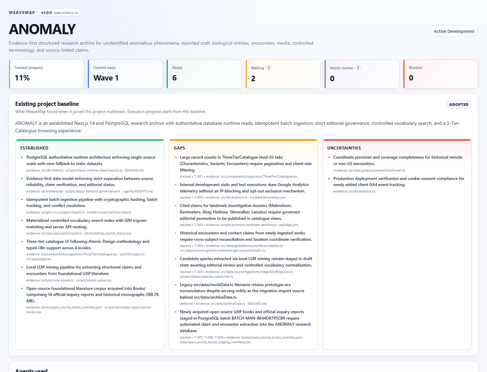
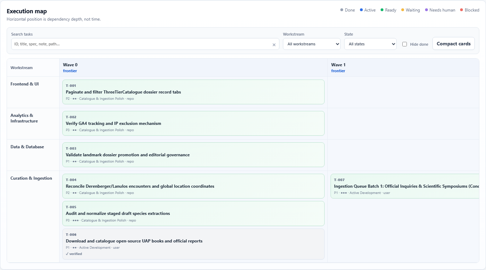

# WeaveMap

**Project management for AI. A map for humans.**

[](https://github.com/Srinevasan22/weavemap)

**Current runtime:** `v1.0.0` · **State schema:** `v4`

WeaveMap is a tiny, repo-local project manager designed primarily for AI coding agents. The AI maintains project state, dependencies, provenance, requirements, decisions, handoff notes, approval gates, verification instructions, requirement coverage, and lightweight completion evidence. The human opens a static observer to see what can run now, what is waiting normally, what genuinely needs intervention, and how work moves through dependency waves.

## Quick Install

Drop WeaveMap into any repository with a single command:

**macOS / Linux / WSL / Git Bash:**
```bash
curl -fsSL https://raw.githubusercontent.com/Srinevasan22/weavemap/main/install.sh | bash
```

**Windows (PowerShell):**
```powershell
irm https://raw.githubusercontent.com/Srinevasan22/weavemap/main/install.ps1 | iex
```

<details>
<summary>Or manually copy the files into your project</summary>

```text
your-project/
├── src/
├── ...
└── weavemap/
    ├── PROTOCOL.md
    ├── state.js
    ├── index.html
    ├── app.js
    └── style.css
```
</details>

Then tell any coding AI:

> Read `weavemap/PROTOCOL.md` and use WeaveMap to manage this project as you work.

Open `weavemap/index.html` whenever you want to inspect or steer the project.

## Versioning

WeaveMap has two independent versions:

- **Runtime version** — observer/protocol release, currently `v1.0.0`.
- **State schema version** — durable project-data structure in `state.js`, currently `v4`.

The runtime version is visible in the observer header and exposed as:

```js
window.WEAVEMAP_RUNTIME
// { version: "1.0.0", schemaVersion: 4 }
```

Runtime `v1.0.0` adds only optional task metadata and derived observer features, so existing schema-v4 projects do **not** require migration.

## New or already in progress

WeaveMap works both at the start of a project and when added halfway through an existing one.

- **New** — the AI creates the initial requirements, tasks, dependencies, and execution map.
- **Adopted** — the AI first creates an evidence-backed baseline of established capabilities, gaps, and uncertainties, then tracks actionable work from that point forward.

For adopted projects, WeaveMap does not fabricate historical completed tasks just to make progress look complete.

## Add WeaveMap to an existing project

Give your coding agent the repository URL and use:

> Add WeaveMap to this existing project.  
> From `https://github.com/Srinevasan22/weavemap`, copy `PROTOCOL.md`, `state.js`, `index.html`, `app.js`, and `style.css` into a new `weavemap/` folder.  
> Read `weavemap/PROTOCOL.md`, inspect the existing project, and initialize WeaveMap in adoption mode.  
> For the first pass, do not implement application changes. Only analyze the project and populate WeaveMap accurately.

Then review the baseline, evidence, requirement coverage, dependencies, Ready Frontier, Waiting tasks, genuine Blockers, Needs Human gates, coordination warnings, and agent/model information.

## Safe updates without losing project data

WeaveMap separates replaceable runtime files from durable project data.

Safe to replace:

```text
weavemap/PROTOCOL.md
weavemap/index.html
weavemap/app.js
weavemap/style.css
```

Never overwrite during a runtime update:

```text
weavemap/state.js
```

The version badge opens a safe-update prompt. The update flow is:

1. Back up the existing `state.js`.
2. Replace only the four runtime files.
3. Read the new protocol.
4. Migrate the existing state only if the schema changed.
5. Validate the observer.
6. Remove the backup only after validation succeeds.

You can also tell an AI:

> Update WeaveMap in this project to the latest version from `https://github.com/Srinevasan22/weavemap`. Back up `weavemap/state.js`, replace only `PROTOCOL.md`, `index.html`, `app.js`, and `style.css`, never replace the project's state with the blank template, read the new protocol, migrate only if the schema changed, preserve all project knowledge, validate, and delete the backup only after validation passes.

## Core execution model

[](https://github.com/Srinevasan22/weavemap)

- **Tasks** contain goal, implementation spec, acceptance criteria, priority, effort, status, dependencies, and handoff notes.
- **Dependencies** are hard execution dependencies.
- **Waves** are calculated dependency depth, not dates or weeks.
- **Ready** means the AI can work on it now.
- **Waiting** means a normal unfinished dependency exists. This is not a problem.
- **Blocked** means a genuine obstacle independent of normal dependency sequencing.
- **Needs human** means an explicit human approval gate has reached the point where a user decision is required.
- **Ready Frontier** is the AI-executable work available now.

The observer includes tooltips so Waiting and Needs Human are not confused with blockers.

## Human control

The observer can steer the project directly through merge-safe edits to the latest `state.js`:

- add human handoff notes;
- change priority;
- approve or reject human gates;
- mark done as an explicit human verification override;
- skip;
- block with a reason;
- reopen.

Human actions are written into the latest state rather than overwriting a stale browser snapshot.

### Human approval gates

Use optional task metadata when work must not be treated as authorized without explicit user approval:

```js
humanApproval: {
  required: true,
  status: "pending"
}
```

A pending gate appears under **Needs human**. The AI must not approve it by assumption. Typical uses include art direction, product scope, publishing, destructive migrations, and release approval.

## Agent execution metadata

Optional fields reduce rediscovery and make multi-agent work safer.

### Task origin

```js
origin: "user" // or "repo" / "agent"
```

This makes the source of work visible. `origin: "agent"` means AI-proposed work, not automatically committed product scope.

### Requirement coverage

```js
requirementIds: ["R-002", "R-006"]
```

The observer derives active requirement coverage from these links and highlights active requirements with no non-skipped task coverage. This is a planning signal, not automatically an error.

### Expected edit scope

```js
affectedPaths: [
  "scanner_v2/test_samples/**"
]
```

This is advisory, not a file lock. WeaveMap now compares `affectedPaths` for ready/active tasks and surfaces likely parallel-edit collisions as coordination warnings.

### Verification command

```js
verification: {
  command: "py scanner_v2/test_regression.py"
}
```

The browser does not execute this command. It is an instruction for the coding agent so it can prove acceptance without rediscovering the correct test command every session.

### Structured verification result

New task completions can record exactly what happened:

```js
completion: {
  by: "Antigravity",
  commit: "dbf2d95",
  verification: {
    command: "py scanner_v2/test_regression.py",
    result: "passed"
  }
}
```

Supported results are `passed`, `failed`, `not-run`, `human-override`, and `not-applicable`. A task cannot validly be `done` with a structured `failed` result.

Legacy v0.9 string-form verification remains readable, but agents should use the structured form for new completions.

## Search and scaling

For larger projects, the observer now includes:

- task search across IDs, titles, specs, notes, workstreams, expected paths, origins, and linked requirement IDs;
- workstream filter;
- state filter;
- Hide Done toggle;
- Compact / Detailed card toggle;
- derived requirement coverage;
- derived path-overlap coordination warnings;
- separate Waiting, Needs Human, and genuine Blockers sections.

The map remains useful for architecture and dependency visibility, while the Ready Frontier / Needs Human / Blockers panels support day-to-day work.

## Persistent task handoff notes

Every task has `notes: []`. Agents must read them before starting or resuming work.

Use them for concise context such as findings already checked, test results, failed approaches, useful file paths/commands, environment caveats, user clarifications, and what the next pass should try.

Human notes are prefixed `Human:`.

The observer's note editor re-reads the latest `state.js`, merges only the new note, checks for concurrent changes, and writes the merged result. You do not need to refresh first just because an AI may have changed the state file.

## Adoption fidelity

Schema v4 keeps adopted-project knowledge verifiable:

- baseline findings can carry concise evidence paths;
- gaps are `tracked`, `deferred`, or `accepted`;
- tracked gaps point to tasks;
- requirements and decisions carry `origin: "user" | "repo" | "agent"`;
- agent-origin scope is explicitly provisional, not automatically committed production scope;
- the observer validates IDs, statuses, priorities, effort, dependencies, cycles, provenance, requirement links, gaps, notes, approval metadata, verification metadata, affected paths, and completion metadata.

## Planning-quality rules

WeaveMap tells agents to:

- split tasks that contain multiple independently testable outcomes, even if total effort is below 5;
- use `dependsOn` only for true hard dependencies;
- run a dependency sanity pass after initial planning or major replanning;
- review uncovered active requirements before finalizing a plan;
- keep agent-proposed scope provisional until the user commits to it;
- create explicit human approval gates for material scope decisions;
- check `affectedPaths` overlap before parallel work;
- record verification results rather than merely claiming a task is done.

## No install

WeaveMap has:

- no build step;
- no package manager;
- no database;
- no account;
- no cloud service;
- no external JavaScript or CSS dependencies.

Project state travels with the repository in `weavemap/state.js`.

## Philosophy

WeaveMap does not try to be Jira, Trello, or Notion. The AI is the project manager; the human interface is for observability and intervention.

WeaveMap optimizes for **minimum useful AI context**, not minimum bytes on disk.
